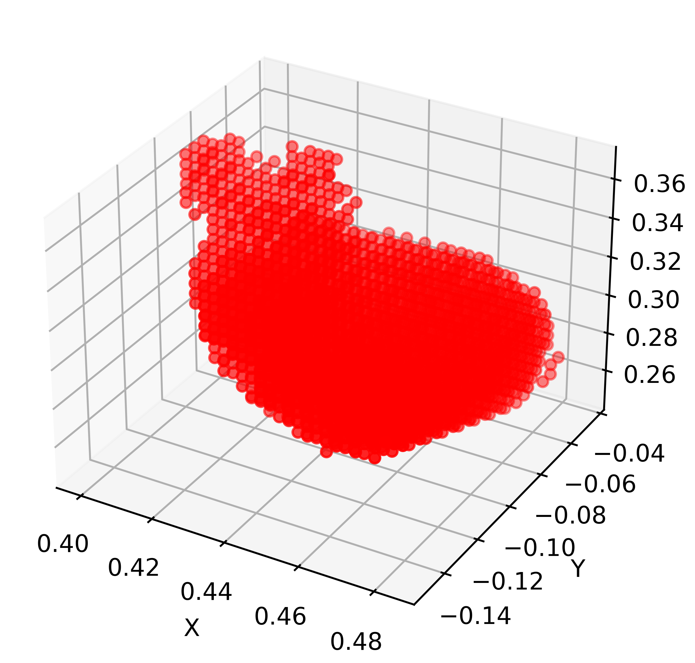

# FusionSense
Integrates the vision, touch, and common-sense information of foundational models, customized to the agent's perceptual needs.

## Usage

1. **Select frames**:  

    Run `delete.py` to select frames you want, or manually select, and you will get a folder of selected frames and transforms.json.  

    **Remember to set `transforms.json` in right format.**

2. **Generate Mask_imgs by [Grounded_SAM_2](https://github.com/IDEA-Research/Grounded-SAM-2)**:   

    set your scene path and prompt text with the end of '.'   
    `eg. 'transparent white statue.'`   

    ```python   
    python grounded_sam2_hf_model_imgs_MaskExtract.py   
    ```   
    run the script to extract masks.   

    If the `num_no_detection` is not 0, you need to select the frame again. Then you will see mask_imgs in `path/masks`, and you can check `path/annotated` frames to see the results more directly.   
    
3. **Generate VisualHull by masks and transforms.json**:  

    run `VisualHull.py` to generate visual hull.  
    ```bash  
    python VisualHull.py --path your-path  
    ```
    
    You will get a point cloud file `foreground_pcd.ply`, and a screenshot `voxels.png` of checking whether the generated VisualHull is correct.    
    

4. **RealSense depth & [Metric3Dv2](https://github.com/YvanYin/Metric3D) depth**:  

    Get your realsense depth from your camera file in `realsense_depth` folder.  

    Use your RGB images to generate predict depth with Metric3Dv2.  
    ```bash
    python run_metric3d_depth.py --root_dir your-path
    ```
    **Remember to set your camera intrinsics and image size in that file**   

5. **Generate initial GS model sparse points**:  

    run the script to generate initial sparse points using VisualHull pcd as forground and Metric3Dv2 depth as background.    
    ```bash
    python generate_pcd.py --path your-path   
    ```

    The initial points will be saved in `path/merged_pcd.ply`  

6. **Generate normals by dsine**:

    set your rgb images path to generate normals.  
    ```bash
    python dn_splatter/scripts/normals_from_pretrain.py --data-dir [PATH_TO_DATA] --model-type dsine  
    ```

7. **Set transforms and configs**:

    To use realsense depth, set `"depth_file_path": "realsense_depth/depth_0.png"` each frame     

    To use initial pts, set `"ply_file_path": "merged_pcd.ply"`     

    To use Visual Hull prune supervised method, set `"object_pc_path": "object.ply"`    

8. **Train**:

    Select your method and configs.
    ```bash
    ns-train dn-splatter --pipeline.model.use-depth-loss True\
                        --pipeline.model.normal-lambda 0.4\
                        --pipeline.model.sensor-depth-lambda 0.2\
                        --pipeline.model.use-depth-smooth-loss True \
                        --pipeline.model.use-normal-loss True\
                        --pipeline.model.normal-supervision mono\
                        --pipeline.model.random_init False normal-nerfstudio\
                        --data your-path\
                        --load-pcd-normals True --load-3D-points True  --normal-format opencv
    ```

    To Train with touches:
    
    ```bash
    ns-train dn-splatter --pipeline.model.use-depth-loss True\
                        --pipeline.model.normal-lambda 0.4\
                        --pipeline.model.sensor-depth-lambda 0.2\
                        --pipeline.model.use-depth-smooth-loss True \
                        --pipeline.model.use-normal-loss True\
                        --pipeline.model.normal-supervision mono\
                        --pipeline.model.random_init False normal-nerfstudio\
                        --data your-path\
                        --load-touches True
                        --load-pcd-normals True --load-3D-points True  --normal-format opencv
    ```

9. **Mesh Extraction**:
    ```python
    gs-mesh {dn, tsdf, sugar-coarse, gaussians, marching} --load-config [PATH] --output-dir [PATH]
    ```

## Dataset Format
```bash
tr-rabbit/
│
├── transforms.json
│
├── images/
│   ├── rgb_1.png
│   └── rgb_2.png
│
├── normals_from_pretrain/
│   ├── rgb_1.png
│   └── rgb_2.png
│
├── realsense_depth/
│   ├── depth_1.png
│   └── depth_2.png
│
├── object.ply
└── merged_pcd.ply
```

